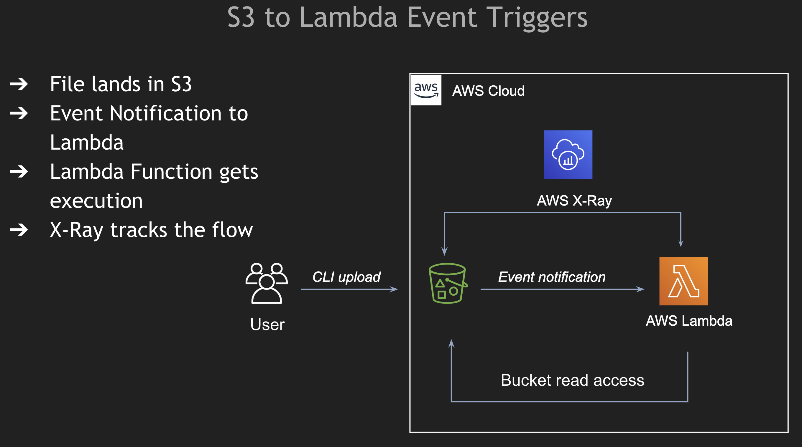

# S3 to Lambda sample Lambda

## Feature
Reads the file pushed on the S3 bucket based on which the event was raised.

## Commands used
- `aws s3 mb s3://lambda-trigger-files` - Create a new bucket named `lambda-trigger-files`
- `aws s3 ls` - List S3 Bucket names
- `aws s3 cp temp.txt s3://lambda-trigger-files` - Copy files from load to AWS S3 Bucket

## Architecture

## References
- [AWS Docs](https://docs.aws.amazon.com/lambda/latest/dg/java-handler.html)
